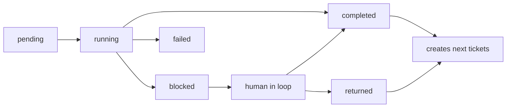

# AutoAgent 现实工单流设计

## 目标

AutoAgent 的运行核心必须像现实团队里的工单系统：用户提出想法，老板做需求接收和商业/目标判断，产品或项目角色把需求拆成可执行工单图，之后所有执行、返工、阻塞、人工介入和验收都围绕工单流转。

这个设计要解决当前最核心的问题：系统表面上有工单，但底层仍有一套隐藏的固定阶段机。隐藏阶段机会让 QA 打回、老板越权、PM 澄清、人工测试通过等情况被错误地转到不相关角色，用户也无法从 UI 判断是谁提出了什么问题、下一步该谁处理。

## 核心原则

1. 工单是唯一流程事实来源。
   `MissionControl` 可以保留 `phase` 作为 UI 投影，但不能再让 `nextPhase` 决定团队下一步做什么。

2. 工单可以创建工单。
   老板接收工单完成后创建 PM 计划工单；PM 计划工单完成后创建执行工单图；QA 失败创建开发返工工单；人工测试失败创建返工工单；需求不清创建澄清工单。

3. 启动拆解期和执行期是同一个工单系统的两个阶段，不是两套流程。
   用户和老板通常不会提前拆出完整工程工单，所以启动期可以是固定的“想法 -> 老板 -> PM”。PM 之后生成的执行工单图才是项目执行计划。

4. 角色权限不等于文件权限。
   老板、PM、架构师、QA 可以写自己职责内的文档和报告；开发负责产品源码和可运行交付物。边界应按工单责任和交付物类型判断，而不是简单地按角色禁止写文件。

5. Human in flow 是默认，human in loop 是异常或边界态。
   用户平时观察团队流动；当某个 Agent 需要人工测试、授权、澄清或验收时，问题挂在该 Agent/工单上，用户点进该 Agent 后进入单 Agent 对话。

## 分层模型

```text
用户想法
  -> 老板需求接收工单
  -> PM 计划拆解工单
  -> TicketGraph v1
       -> 架构工单
       -> 开发工单
       -> QA 工单
       -> 老板验收工单
       -> 返工/澄清/人工测试等动态工单
```

这里的“老板 -> PM”不是隐藏流程，而是系统启动时创建的第一批工单。后续每一步都必须由已完成工单的结果显式创建下一张工单。

## 工单状态机

P0 使用这组状态：

- `pending`: 已创建，等待投递或等待前置依赖完成。
- `running`: 已被 Agent 领取，正在执行。
- `blocked`: 需要人工、授权、外部资源或环境能力。
- `completed`: 交付完成，结果可供后续工单使用。
- `returned`: 被后续环节打回，已产生返工或澄清工单。
- `failed`: 工单无法完成，且没有可自动创建的后续工单。
- `cancelled`: 任务停止后取消。

状态流转规则：



## 工单创建规则

P0 先落地确定性的默认工单图：

| 当前工单 | 正常完成后创建 |
| --- | --- |
| `boss_intake` | `pm_plan` |
| `pm_plan` | `architect_plan` |
| `architect_plan` | `implementation` |
| `implementation` / `rework` | `qa` |
| `qa` | `boss_acceptance` |
| `boss_acceptance` | 任务完成 |

动态工单规则：

- QA 发现真实缺陷：当前 QA 工单完成并创建开发返工工单，父工单指向 QA。
- QA 缺少浏览器等外部验证能力：QA 工单进入 `blocked`，阻塞类型为 `manual_test_required`。
- 用户人工测试通过：QA 工单完成并创建老板验收工单。
- 用户人工测试失败：QA 工单 `returned`，创建开发返工工单。
- 开发发现需求冲突或验收标准不清：创建 PM 澄清/改计划工单。
- 开发发现架构、接口、能力边界问题：创建架构工单或专家工单。
- 非源码职责角色试图修改源码：不是失败，也不是找人类，而是创建开发工单；如果是写报告或文档，则允许在自身交付边界内继续。

## 运行时职责

`MissionControl` 是调度器，不是隐藏 PM。

它负责：

- 创建启动工单。
- 找到可运行工单并投递给对应 Agent。
- 记录工单领取、完成、阻塞、返工、失败。
- 按工单结果创建下一批工单。
- 维护 UI 投影状态。
- 在没有可运行工单且所有工单完成时结束任务。

它不应该：

- 根据 `nextPhase` 自行推进固定阶段。
- 用字符串猜测把任务跳到某个隐藏阶段。
- 在工单之外保存另一份真实流程。

## UI 语义

Run Console 的右侧“运行记录/原始工单”应该展示同一套事实：

- 运行记录：按时间正序，默认按角色/工单折叠，点开看该工单的 loop 详情。
- 原始工单：按工单正序展示父子关系、状态、目标角色、交付物、结果 JSON。
- Canvas 头像：谁发出阻塞、人工测试、澄清或验收请求，谁的头像显示感叹号。
- 选中头像：进入该 Agent 当前工单的 human-in-loop 对话。

## 第一阶段落地范围

本阶段不做完整可视化工单编辑器，也不做动态招聘系统。先让运行核心不再依赖隐藏阶段机：

1. 新任务启动时立即创建 `boss_intake` 工单。
2. 运行循环从待处理工单中取下一张工单，而不是从 `nextPhase` 取下一阶段。
3. 每张工单完成后显式创建后续工单，并保存 `parentTicketId` / `createdByTicketId`。
4. 返工、人工测试通过/失败都通过新工单继续流转。
5. `TaskRun.phase` 和 `MissionState.nextPhase` 只作为当前/下一工单的 UI 投影。
6. 测试覆盖老板越权、QA 返工、人工测试通过、普通 happy path。

## 上线标准

第一阶段达到可上线试用必须满足：

- `npm.cmd run test:run` 通过。
- `npm.cmd run typecheck` 通过。
- `npm.cmd run build` 通过。
- 本地浏览器打开运行台不出现布局破坏或控制台错误。
- 新建坦克大战任务时，原始工单能看出从老板到 PM 再到执行工单的父子链。
- QA 人工测试通过后流向老板验收；QA 失败流向开发返工；不能再绕回 PM，除非工单结果明确是需求/计划问题。

