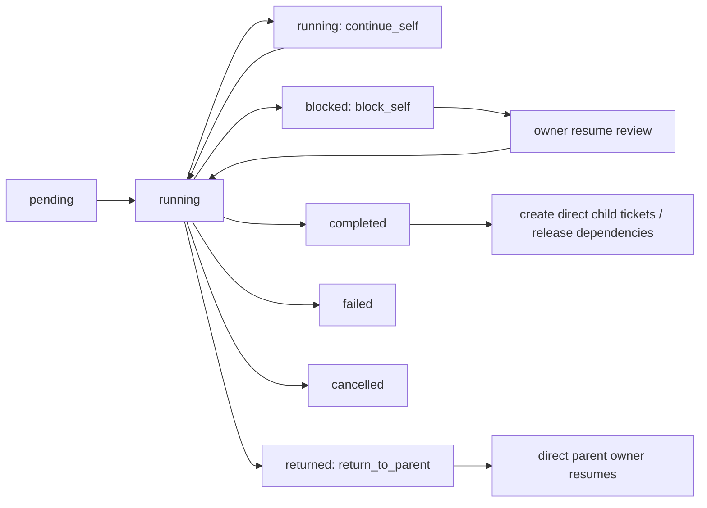

# AutoAgent 现实工单流设计

## 目标

AutoAgent 的运行核心必须像现实团队里的工单系统：用户提出想法，老板做需求接收和目标判断，产品或项目角色把需求拆成可执行工单图，之后所有执行、返工、阻塞、人工介入和验收都围绕工单流转。

这个设计要解决当前最核心的问题：系统表面上有工单，但底层仍残留一套隐藏阶段机。隐藏阶段机会让 QA 打回、老板越权、PM 澄清、人工测试通过等情况被错误地转到不相关角色，用户也无法从 UI 判断是谁提出了什么问题、下一步该谁处理。

本设计的结论是：工单是 flow，Agent 是远程员工，Agent 之间不直接聊天。Agent 通过工单系统交接；LLM 做业务判断；平台代码只把 LLM 的结构化结果映射成合法工单动作，并记录、校验和投递。

## 核心原则

1. 工单是唯一流程事实来源。
   `MissionControl` 可以保留 `phase` 作为 UI 投影，但不能再让 `nextPhase` 或固定阶段表决定团队下一步做什么。

2. LLM 做判断，代码做投递和校验。
   当前 Agent 根据当前工单、上下文、工具结果和 human 回复判断应该怎么处理。平台代码不从自然语言里猜业务含义，只消费结构化 action，并校验这个 action 是否符合工单拓扑和权限边界。

3. 工单只能单层流转。
   一张工单只有三类正常动作：自己处理、向下派生直接子工单、向上打回直接父工单。禁止跨层跳转，例如 QA 不能直接跳 PM，开发不能直接跳老板，PM 不能因为发现缺源码就直接跳开发。需要跨层时，由每一层的 owner Agent 逐层判断和流转。

4. 启动拆解期和执行期是同一个工单系统，不是两套流程。
   用户和老板通常不会提前拆出完整工程工单，所以启动期可以由平台种下第一张 `boss_intake` 工单。老板完成接收后向下派生 `pm_plan`。PM 的职责是产出项目执行工单图；PM 之后不存在隐藏默认链。

5. 工单图可以提前排，也可以运行中动态派生。
   PM 可以一次性创建带依赖关系的工单图，让架构、开发、QA、验收工单先可见但按依赖领取。任何 Agent 在执行中也可以按当前工单向下派生直接子工单。预排和动态派生都必须写入同一套工单账本。

6. 父子关系表达责任链，不只是创建者。
   PM 可以创建整张图，但每个工单的直接父工单应是它实际消费的上游产物。例如 QA 的父工单通常是开发工单，开发的父工单可能是架构工单或 PM 计划工单。QA 发现缺陷时只能打回开发父工单；如果开发判断是需求问题，再由开发打回自己的父工单。

7. 角色权限不等于文件权限。
   老板、PM、架构师、QA 可以写自己职责内的文档和报告；开发负责产品源码和可运行交付物。边界应按工单责任和交付物类型判断，而不是简单按角色禁止写文件。

   P0 的具体规则是：非开发角色可以写 `docs/`、`reports/`、`plans/` 目录下的 `.md/.txt` 文档；不能写源码、HTML、配置、脚本或可运行交付物。工具拒绝写入时，结果返回给当前 Agent；当前 Agent 再决定自处理、向下派生或向上打回，平台不能替它自动路由。

8. Human in flow 是默认，human in loop 是异常或边界态。
   用户平时观察团队流动；当某个 Agent 需要人工测试、授权、澄清或验收时，问题挂在该 Agent/工单上，用户点进该 Agent 后进入单 Agent 对话。

9. Human 消息首先是时间序消息，然后才可能触发工单恢复。
   human 给某个 Agent 的私聊、blocked 工单的补充、人工测试反馈，本质上都要进入目标 Agent 的 session 时间线。事件日志、状态文件和 UI 卡片只是审计与投影，不能成为另一条模型上下文旁路。blocked 工单收到 human 消息时，平台不能直接把消息当批准、失败或继续；它必须先把这条消息写入 owner Agent session，再让 owner Agent 做一次 resume review turn，输出结构化 action；平台只消费 action 来推进工单。

## 工单模型

启动期最小链路：

```text
用户想法
  -> boss_intake 工单
  -> pm_plan 工单
  -> PM 返回 TicketGraph
```

执行期由 TicketGraph 或运行中派生继续：

```text
父工单(owner Agent)
  -> 向下派生直接子工单
      -> 子工单(owner Agent)
          -> 自己处理
          -> 向下派生直接子工单
          -> 向上打回直接父工单
```

这里的“老板 -> PM”不是隐藏流程，而是系统启动时写入账本的第一批工单。PM 之后每一步都必须来自工单结果里的结构化 action，或者来自 PM 返回的 TicketGraph。

## Agent 输出契约

Agent 的自然语言解释可以给人看，但平台状态机只消费结构化 action。P0 使用这组动作：

- `continue_self`: 当前工单继续由当前 Agent 处理，通常用于下一轮工具调用、补充分析或继续对话。
- `block_self`: 当前工单进入阻塞，等待 human、授权、外部环境、工具能力或目标 Agent 空闲。
- `complete`: 当前工单完成。可同时返回 `child_tickets`，由平台创建直接子工单。
- `return_to_parent`: 当前工单无法继续，因为直接父工单提供的输入、前置、交付物或约束不足。平台只允许打回直接父工单。
- `fail`: 当前工单无法完成，且没有合法的自处理、向下派生或向上打回路径。
- `cancel`: 用户或上游明确取消。

示例：PM 发现目标前置缺失，不能自己拆解：

```json
{
  "action": "return_to_parent",
  "reason": "项目目录没有源码、实现文件或可运行交付物，无法基于现状拆解修复工单。",
  "blocker_type": "missing_prerequisite",
  "facts": ["项目目录只有 README，缺少 index.html、package.json 或其他实现文件"],
  "required_from_parent": "请老板确认是补充现有源码、授权从零重建，还是取消任务。"
}
```

示例：PM 完成拆解并创建执行工单图：

```json
{
  "action": "complete",
  "summary": "已将目标拆成可执行工单图。",
  "child_tickets": [
    {
      "key": "architecture",
      "type": "architect_plan",
      "brief": "确认技术路线、边界和交付结构。",
      "expectedArtifact": "架构方案",
      "targetRole": "architect"
    },
    {
      "key": "implementation",
      "type": "implementation",
      "brief": "按方案实现可运行版本。",
      "expectedArtifact": "可运行交付物",
      "targetRole": "dev",
      "parentKey": "architecture",
      "dependsOn": ["architecture"]
    },
    {
      "key": "qa",
      "type": "qa",
      "brief": "验证实现并给出通过或失败结论。",
      "expectedArtifact": "测试报告",
      "targetRole": "qa",
      "parentKey": "implementation",
      "dependsOn": ["implementation"]
    },
    {
      "key": "acceptance",
      "type": "boss_acceptance",
      "brief": "验收交付是否满足目标。",
      "expectedArtifact": "验收结论",
      "targetRole": "boss",
      "parentKey": "qa",
      "dependsOn": ["qa"]
    }
  ]
}
```

字段语义：

- `key`: 当前工单图内的临时标识，供 `parentKey` 和 `dependsOn` 引用。
- `type`: 工单类型，支持 `boss_intake`、`pm_plan`、`architect_plan`、`implementation`、`qa`、`boss_acceptance`、`specialist`、`rework`、`human_action`。
- `brief`: 交给目标 Agent 的任务说明。
- `expectedArtifact`: 该工单预期产物。
- `targetRole`: 目标角色。
- `parentKey`: 直接父工单。没有填时，平台可用第一项 `dependsOn` 作为父工单；仍然必须是图内相邻责任链，不能默认指向 PM。
- `dependsOn`: 依赖的计划项 `key`。依赖未完成时，工单可以显示在原始工单里，但不能被 Agent 领取。

不再使用 `target_phase`、`return_to: "pm_plan"` 这类跨阶段字段。角色名、阶段名、自然语言理由都不能成为平台跳转依据。

## 工单状态机

P0 使用这组状态：

- `pending`: 已创建，等待投递或等待前置依赖完成。
- `running`: 已被 Agent 领取，正在执行。
- `blocked`: 当前工单需要 human、授权、外部资源、工具能力或目标 Agent 空闲。owner 不变。
- `completed`: 当前工单完成，结果可供后续工单使用。
- `returned`: 当前工单已打回直接父工单，等待父工单 owner 继续处理。
- `failed`: 当前工单或任务无法完成，且没有合法后续动作。
- `cancelled`: 任务停止后取消。
- `dead_letter`: 消息投递超过重试或租约规则，等待人工处理。

状态流转规则：



父工单已经 `completed` 时，打回可以实现为“重新激活父工单”或“创建父工单修订消息/工单”。这属于实现细节，但 owner 必须是直接父工单 owner，不能跨层找一个看起来合适的角色。

## Human Resume Review

human-in-loop 看起来像聊天，但它不是旁路状态。对模型来说，它仍然是按时间排序的对话消息。普通聊天 loop 是：

```text
message -> Agent answer
```

工单恢复 loop 是：

```text
human message appended to owner Agent session -> blocked ticket state -> owner Agent resume review -> structured action -> ticket transition
```

输入必须包含：

- 当前 blocked 工单。
- 阻塞类型和原因。
- 上一次 Agent 输出和工具结果。
- session 时间线中的最新 human 回复。
- 当前工单允许的 action 集合。
- 当前工单的父子关系和依赖状态。

输出必须是结构化 JSON，例如：

```json
{
  "action": "block_self",
  "reason": "human 在询问为什么需要授权，不是授权继续。",
  "reply_to_human": "生产部署会影响线上环境，需要你确认是否允许继续。"
}
```

人工测试边界示例：

```json
{
  "action": "return_to_parent",
  "reason": "human 报告子弹穿墙，交付物未通过人工测试。",
  "defects": ["子弹穿墙"],
  "required_from_parent": "请根据缺陷修复后重新提交 QA。"
}
```

或：

```json
{
  "action": "complete",
  "summary": "human 按测试计划完成验证，当前 QA 工单通过。"
}
```

平台禁止从 human 文本、Agent 的 `reason` 或 `report` 中用关键词猜测“通过、失败、授权、返工目标”。human 问一句“为什么需要我测”，就应作为一条时间序 user message 进入当前 Agent 的下一次 LLM review，而不是被平台关键字规则判定为通过或失败。

平台也不能把 `humanFollowups`、`agentMessages`、`latestAgentDirectMessage` 这类数组或最新消息作为第二条动态上下文通道整体注入 prompt。若 human 消息需要影响模型，它必须已经存在于目标 Agent 的 session timeline 中；动态上下文只保留当前工单、阻塞类型、允许动作、事件 id 等结构化状态。

## 典型流转

### PM 发现前置不足

现实团队中，PM 接到老板给的目标后，如果发现目标前置不存在，例如源码缺失、现状交付物不存在、业务目标无法判断，不应该自己假装拆解，也不应该直接安排开发。PM 应当把这张工单打回直接父工单老板：

```text
pm_plan --return_to_parent--> boss_intake
```

老板收到后由老板 LLM 决定下一步：向 human 澄清、授权从零重建、创建调查子工单、调整目标或取消任务。平台不创建额外“决策模型”。

### 开发发现需求或架构前置问题

开发遇到上游输入不成立时，只能打回直接父工单：

```text
implementation --return_to_parent--> architect_plan 或 pm_plan
```

如果父工单是架构师，架构师判断确实是需求问题，再由架构师继续向上打回 PM。平台不允许开发因为 reason 里出现“需求”就直接跳 PM。

### QA 发现缺陷

QA 的父工单应是它验证的开发或返工工单。QA 发现真实缺陷时：

```text
qa --return_to_parent--> implementation/rework
```

开发修复完成后再向下派生或释放 QA。平台不再根据 `qa` 阶段失败自动创建某个 `implementation` 阶段。

### QA 缺少浏览器能力

QA 缺少当前工具环境无法完成测试时，是当前 QA 工单阻塞：

```text
qa --block_self(manual_test_required)--> human-in-loop
```

human 回复后，QA 先做 resume review。QA 判断通过则 `complete`，判断失败则 `return_to_parent`，继续追问则 `block_self`。

### 工具写入被拒绝

工具权限错误是工具结果，不是平台业务判断。比如老板尝试写 `index.html` 被拒绝，平台只把工具错误返回给老板工单。老板可以：

- `continue_self`: 改写报告或调整自己的结论。
- `block_self`: 向 human 请求授权或说明无法继续。
- `create child_tickets`: 向下派生开发调查或重建工单。
- `return_to_parent`: 如果老板工单也有父工单，则打回父工单；根工单则只能 human-in-loop。
- `fail`: 明确任务无法继续。

平台不能因为“写源码失败”就自动创建开发工单；那是老板 LLM 的业务决定。

## 运行时职责

`MissionControl` 是调度器、账本和投递器，不是隐藏 PM，也不是隐藏经理。

它负责：

- 创建启动工单。
- 找到可运行工单并投递给对应 Agent。
- 维护 inbox message、dedupe key、correlation id、lease、重试和 dead letter。
- 记录工单领取、完成、阻塞、打回、失败。
- 校验 Agent action 是否属于允许集合。
- 校验 `return_to_parent` 只能回直接父工单。
- 校验 `child_tickets` 只能成为当前工单的直接子工单或图内合法责任链。
- 维护依赖解锁和 UI 投影状态。
- 在没有可运行、阻塞或待投递工单且所有工单完成时结束任务。

它不应该：

- 根据 `nextPhase` 自行推进固定阶段。
- 根据 `target_phase`、角色名或字符串关键字跳转。
- 从 human 文本直接判断通过、失败、授权或返工。
- 在工单之外保存另一份真实流程。
- 在 session 之外保存另一份会影响模型判断的 human 消息流。
- 因工具错误替 Agent 选择业务路线。

因此，现有 `defaultTransferPhaseForObstacle`、`targetPhaseFromStructured`、`phaseAfterHumanFollowup`、`routeBackToPhaseOrFail` 这类阶段路由入口都应被工单 action 映射替换或删除。

## 消息投递和忙碌 Agent

Agent 之间不直接通讯。所有交接通过 ticket + inbox message：

- 新工单生成一条 inbox message。
- 目标 Agent 空闲时领取 message，并获得 lease。
- Agent 忙碌时，message 保持 `pending` 或 ticket 进入 `blocked(waiting_for_agent_capacity)`。
- lease 到期可重新投递。
- 重复投递靠 dedupe key 和 correlation id 去重。
- 多个可运行工单按 priority、依赖完成时间和创建时间调度。

这让平台更接近真实工单系统：消息可以排队、重试、超时、死信，而不是函数调用式同步跳转。

human 给单个 Agent 的私聊不是 Agent 之间的工单交接，但也必须遵守同一条时间线原则：

- 先写入目标 Agent 的 session，作为下一次模型上下文的一条 `user` 消息。
- 再写入事件日志和状态投影，供 UI 显示气泡、感叹号和运行记录。
- 如果目标 Agent 正在执行当前 provider 调用，这条消息不能插入正在进行的调用，只能在下一次 turn 生效。
- 如果这条消息是在恢复某张 blocked 工单，则由该工单 owner Agent 做 resume review。
- 不能同时把同一条消息又通过 `dynamic_context.agentDirectMessages` 或类似字段注入 prompt。

## Prompt 和代码规则边界

代码里可以有提示词模板和输出 schema，因为这是平台与 Agent 的通信协议，不是隐藏业务流转。提示词必须做三件事：

- 告诉 Agent 当前身份、soul、能力、当前工单和上下文。
- 告诉 Agent 当前允许的 action 集合。
- 要求 Agent 返回结构化 JSON，并把自然语言解释放在可展示字段里。

提示词不应该写死“QA 失败就去开发”“PM 缺源码就去开发”这种跨层业务规则。类似规则应由当前 Agent 的 LLM 判断后，以 `return_to_parent` 或 `child_tickets` 显式表达，再由代码按工单拓扑投递。

所有 prompt、工具调用、结构化结果、状态映射结果都必须进入 loop 日志，方便用户判断是 Agent 判断错、prompt 边界错、工具错，还是平台投递错。

## UI 语义

Run Console 的右侧“运行记录/原始工单”应该展示同一套事实：

- 运行记录：按时间正序，默认按角色/工单折叠，点开看该工单的 loop 详情。
- 原始工单：按工单正序展示父子关系、状态、目标角色、交付物、结果 JSON。
- Canvas 头像：谁发出阻塞、人工测试、澄清或验收请求，谁的头像显示感叹号。
- 选中头像：进入该 Agent 当前工单的 human-in-loop 对话。
- 工单卡片：必须标明当前工单的 owner、父工单、子工单、action、阻塞原因和下一步等待谁。

## 第一阶段落地范围

本阶段不做完整可视化工单编辑器，也不做动态招聘系统。先让运行核心不再依赖隐藏阶段机：

1. 新任务启动时立即创建 `boss_intake` 工单。
2. 老板完成后向下派生 `pm_plan` 工单。
3. PM 必须返回 `child_tickets` 或 `return_to_parent`；mock provider 也必须按这个契约返回工单图，不能依赖平台默认链。
4. 运行循环从可运行工单中取下一张工单，而不是从 `nextPhase` 取下一阶段。
5. 每张工单完成后按 action 显式处理：自处理、阻塞、完成并派生子工单、打回父工单、失败或取消。
6. `TaskRun.phase` 和 `MissionState.nextPhase` 只作为当前/下一工单的 UI 投影，不能参与路由决策。
7. 测试覆盖 PM 前置不足打回老板、QA 缺陷打回开发父工单、人工测试回复进入 QA review、工具写入拒绝不自动路由、普通 happy path。

## 上线标准

第一阶段达到可上线试用必须满足：

- `npm.cmd run test:run` 通过。
- `npm.cmd run typecheck` 通过。
- `npm.cmd run build` 通过。
- 本地浏览器打开运行台不出现布局破坏或控制台错误。
- 新建坦克大战任务时，原始工单能看出从老板到 PM 再到执行工单的父子链。
- PM 发现前置不足时打回老板，不默认跳开发，也不在 PM 自己那里死循环。
- QA 人工测试通过后由 QA 完成并解锁/派生老板验收；QA 失败时打回直接父工单开发，不绕回 PM。
- 开发、架构、PM 的上游问题都只能向直接父工单打回；跨层升级必须由每层 owner Agent 决定。
- blocked 工单收到 human 回复时必须先经过 owner Agent 的 resume review turn；提问或信息不足不能被平台直接当成批准继续。
- 运行记录能点开看到 prompt、LLM 原始输出、结构化 action、工具结果、平台映射结果和最终工单状态变化。
