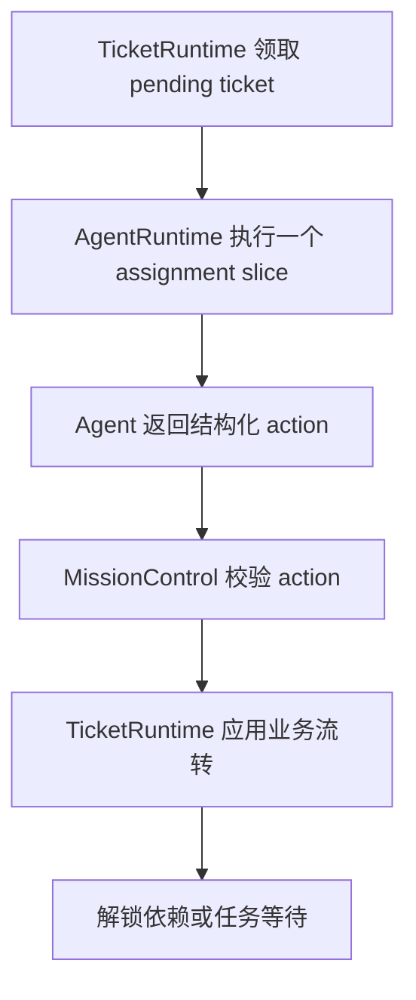
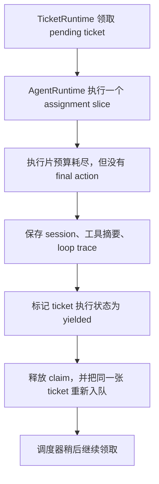

# Ticket 与 Agent 长时间运行设计

日期：2026-07-08

## 目标

AutoAgent 要支持一个真实团队式任务连续运行很久，甚至几个小时或更久，但不能让运行时保护限制变成业务判断。

系统里有两个独立核心：

- Ticket 系统是项目 flow。它负责工单图、依赖、归属、队列、阻塞、完成、打回父工单、任务整体进度。
- Agent 系统是员工运行时。每个 Agent 接收一张 ticket，保留自己的模型可见 session，使用工具，围绕这张 ticket 推理，并返回结构化工单动作。

本设计要解决的是：加入长时间运行能力，但不引入第二套隐藏 flow。预算限制可以暂停一次执行片，但不能说 ticket 失败、Agent 阻塞、或者需要用户介入。

## 当前问题

之前的 AgentRuntime 有类似“工具观察跟进次数”的硬限制。达到限制时，运行时会合成类似“工具观察循环达到上限，任务未形成最终结论”的 blocked 结果。

这个行为本质上和旧的隐藏 phase 系统一样危险：

- 平台替 Agent 做了业务判断。
- 用户看到了假的 human-in-loop 请求。
- Ticket 图状态变得不可信。
- 一个健康但较长的调查过程被显示成坏了。
- 把数字从 4 改成 200 只是延后问题，不是解决问题。

正确方向不是取消所有限制，而是把限制变成技术时间片边界。

## 核心原则

运行预算保护系统，不决定工作。

当一次执行片用完预算时，结果是：

```text
yielded
```

`yielded` 的意思是：

- 当前这一次执行片该停下来了；
- 同一张 ticket 仍然拥有同一个目标；
- 同一个 Agent 后续继续处理；
- 模型可见 session 和工具观察必须已经持久化或压缩；
- 不解锁下游 ticket；
- 不打回上游 ticket；
- 不创建 human-in-loop；
- 不记录任务失败。

只有 Agent 的结构化输出才能产生业务流转：

- `complete`
- `block_self`
- `return_to_parent`
- `fail`
- `cancel`
- `continue_self`

平台可以拒绝非法 action，但不能替 Agent 发明另一个业务 action。

## 和 Codex Goal 模式的关系

Codex 这类长时间工作不是一个无限模型调用，而是外层目标加可重复 turn：

```text
goal -> turn -> 持久化 -> 需要时压缩 -> resume -> 下一个 turn
```

AutoAgent 应该适配成：

```text
mission goal -> ticket goal -> agent 执行片 -> 持久化 -> yielded 后重新入队
```

Codex 的上下文压缩还有一个关键点：原始审计历史和模型可见上下文分离。AutoAgent 也应该保持这个分层：

- loop trace 保存完整 prompt、LLM 返回、工具调用、原始工具输出；
- agent session 保存有边界的模型可见历史；
- context assembler 从稳定 Agent 配置、ticket 状态、压缩 session、最近 turn、工具摘要和动态上下文组装 prompt。

长时间运行必须使用这个分层，不能把旧完整 prompt 一轮轮塞回下一轮 prompt。

## 状态模型

### Mission 状态

Mission 状态仍然是用户看到的任务状态：

- `running`
- `waiting`
- `paused`
- `blocked`
- `completed`
- `failed`
- `stopped`

`yielded` 不是 mission 状态。一张 ticket yield 后，mission 仍可以是 `running` 或 `waiting`。

### Ticket 状态

Ticket 状态只表达业务 flow：

- `pending`：已创建，等待领取或等待依赖完成。
- `running`：当前被 Agent 执行片领取。
- `blocked`：等待 human、授权、人工测试、外部条件，或 Agent 自己需要澄清。
- `completed`：当前工单业务完成。
- `returned`：已打回直接父工单。
- `failed`：Agent 明确判断没有合法路径。
- `cancelled`：用户或系统停止。
- `dead_letter`：投递基础设施多次失败，等待人工处理。

长时间运行不要新增业务状态，而是给 ticket 增加执行元数据：

```ts
interface TicketExecutionState {
  sliceStatus?: "idle" | "running" | "yielded";
  yieldedAt?: string;
  yieldReason?: string;
  continuationCount?: number;
  lastAssignmentRunId?: string;
  nextRunAfter?: string;
}
```

这样业务状态保持稳定，调度状态也能被 UI 看见。

### Agent Assignment 结果

`AgentRuntime.runAssignment` 应该返回两类结果：

```ts
type AgentAssignmentOutcome =
  | {
      kind: "final";
      providerResult: AgentTurnResult;
      toolResults: ToolResult[];
    }
  | {
      kind: "yielded";
      reason: string;
      providerResult?: AgentTurnResult;
      toolResults: ToolResult[];
      continuation: {
        sessionId: string;
        nextTurn: number;
        observedToolCount: number;
      };
    };
```

`kind: "final"` 表示 MissionControl 可以读取 Agent 的结构化 action，并更新 ticket 图。

`kind: "yielded"` 表示 MissionControl 不能把这一轮的 partial structured result 当成业务 action。它只应该持久化本次执行片，标记 ticket 执行状态为 yielded，然后重新入队同一张 ticket。

## 执行流

### 正常完成流



### Yield 流



Yield 等价于“保存进度，稍后继续”，不是“问用户”。

## 预算类型

预算必须显式命名。它们是运行保护，不是业务规则。

### 工具观察预算

目的：避免一张 assignment 在一次执行片内无限工具观察，让调度器有机会持久化和响应暂停/停止。

默认值可以较高，例如 200，适配真实开发。

达到预算时：

- 追加 loop trace：本执行片因工具观察预算让出；
- 把最新模型输出和工具摘要写入 agent session；
- 返回 `kind: "yielded"`；
- 不合成 `status: "blocked"`。

### 执行片墙钟预算

目的：让服务保持响应，确保暂停和停止不是摆设。

达到预算时：

- 尽量等当前 provider/tool 调用自然结束；
- 下一次 provider/tool 调用前 yield；
- 持久化状态。

这比强杀正在写文件的动作安全。

### 上下文预算

目的：控制 prompt 大小，避免上下文腐烂。

达到阈值时：

- 压缩模型可见 session；
- 保留完整 raw trace；
- 继续同一张 ticket。

上下文压缩本身不是 yield，除非压缩无法在当前执行片内完成。

### 基础设施重试预算

目的：识别投递基础设施坏了，而不是识别业务失败。

它只适用于 lease、队列投递、磁盘 IO、provider transport 等基础设施错误。耗尽后可以进入 `dead_letter` 或 infrastructure failure，但不能被显示成 Agent 判断 ticket 失败。

## Agent 自我判断

Agent 应该自己判断 ticket 是否还能继续，但这个判断必须发生在正常 Agent loop 里，而不是平台偷偷插入一个“你是不是坏了”的隐藏流程。

具体规则：

1. 普通 prompt contract 告诉 Agent：如果你判断 ticket 不能继续，可以返回 `block_self`、`return_to_parent` 或 `fail`。
2. yielded ticket 恢复时，prompt 增加一个简短 continuation header：

   ```text
   你正在继续同一张 ticket。上一轮只是运行时执行片让出，不是业务阻塞。
   请从保存的 session 和工具观察继续。如果你现在判断 ticket 无法继续，
   返回正常结构化 action：block_self、return_to_parent 或 fail。
   ```

3. 如果 Agent 多次 yield 但没有新增有效观察，平台不自动失败，只显示“长时间运行 / 低进展”的软提示，并保持 ticket 可继续。

这样符合我们对齐的原则：LLM 做业务判断，平台负责安全、持久化和可观察。

## Ticket 系统职责

TicketRuntime 负责队列语义：

- 领取 ticket；
- 续租或释放 lease；
- yield 后释放 claim 并重新入队；
- 保持父子和依赖图；
- 确保 yielded ticket 不解锁下游；
- 确保 yielded ticket 不被统计为完成或阻塞；
- 按优先级、依赖完成时间、创建时间调度 pending/yielded ticket；
- 已完成 ticket 不可修改；
- 只根据合法 Agent action 创建新 ticket。

TicketRuntime 不应该：

- 根据 phase 名称路由；
- 因运行预算耗尽创建开发、QA、PM 或老板工单；
- 用自然语言关键词猜业务 action；
- 把 yielded 当成 blocked 或 failed。

## Agent 系统职责

AgentRuntime 负责一个执行片：

- 组装上下文；
- 调用 provider；
- 执行 tool intents；
- 追加 loop trace；
- 追加压缩后的 session turn；
- 检测运行预算边界；
- 返回 final Agent 输出或 yielded 执行片结果。

AgentRuntime 不应该：

- 直接改 ticket 图；
- 决定父子路由；
- 因预算耗尽合成业务 blocker；
- 把完整 assembled prompt 写入 agent session；
- 把 raw prompt/tool 证据藏起来。

## MissionControl 职责

MissionControl 连接 ticket 系统和 agent 系统：

- 从 TicketRuntime 获取可运行 ticket；
- 调用 AgentRuntime 让目标 Agent 工作；
- 如果 final，校验并应用 Agent action；
- 如果 yielded，持久化 ticket 执行状态并继续调度；
- 保持 mission 状态真实；
- 所有 ticket 完成、取消、失败，或全部阻塞且无可运行工单时才停止推进；
- 在执行片边界响应暂停/停止。

MissionControl 不应该：

- 使用隐藏 phase successor；
- 用重试次数判定业务失败；
- 把 yielded 变成 human-in-loop；
- 在存在 yielded/pending/running ticket 时完成 mission。

## UI 语义

UI 必须让用户看懂差异：

- `blocked`：需要你、外部条件或授权处理，头像显示感叹号，点进单 Agent 对话。
- `yielded`：系统已保存进度，等待继续执行，不显示 human-in-loop 感叹号。
- `running`：Agent 头像高亮。
- `waiting`：ticket 在队列里，或依赖没准备好。
- `long-running`：多次 yield 但没有 final action 时的软提醒，不阻塞。

建议文案：

```text
开发正在继续同一张工单
上一轮执行片已保存进度，不需要你处理。
```

Loop 详情应展示：

- 第几次执行片；
- 为什么 yield；
- 本执行片的工具观察；
- 当前压缩 session 大小；
- 下次继续时间。

## 持久化

Yield 必须可恢复。服务重启后，同一张 ticket 应该能继续被领取。

至少持久化：

- ticket id；
- ticket execution state；
- session id；
- 最新 assignment run id；
- continuation count；
- yield reason；
- 最新 context report；
- prompt、LLM 返回、工具调用、yield event 的 loop trace。

不能依赖内存里的 `running` set 来保证重启后的正确性。

## 失败边界

系统仍然可以失败，但只能来自真实失败类别：

- provider transport 重试后仍然失败；
- storage 写入失败；
- tool 实现抛出不可恢复错误；
- ticket graph 结构非法；
- 必需 Agent 缺失；
- 用户停止 mission；
- Agent 明确返回 `fail`。

这些必须明确标注为基础设施失败、平台校验失败、用户动作或 Agent 判断。

## 落地计划

### 第一步：文档和类型

- 添加本设计文档。
- 增加 AgentRuntime outcome 类型。
- 给 ticket 增加 yielded 执行元数据。

### 第二步：AgentRuntime Yield

- 删除“工具观察循环达到上限”合成 blocked 的逻辑。
- 改成返回 `kind: "yielded"`。
- 添加 yield loop trace。
- 确保 session 仍写入有边界的模型输出和工具摘要。

### 第三步：TicketRuntime 重新入队

- 增加 API：释放 yielded ticket，并把同一张 ticket 重新放回可运行队列。
- 保留 lease 语义。
- 确保 yielded ticket 不被当作完成或阻塞。

### 第四步：MissionControl 集成

- AgentRuntime yield 时写状态并继续调度。
- 不读取 partial structured result 作为业务输出。
- 在执行片边界支持暂停/停止。
- 有 yielded ticket 时 mission 不能 completed。

### 第五步：UI

- 增加 yielded/继续执行状态文案。
- yielded 不显示 human-in-loop 面板。
- 运行记录里按 owning agent/ticket 展示 yield 记录。

### 第六步：测试

必须覆盖：

- 工具跟进预算耗尽后 yield 并重新入队同一张 ticket；
- yielded ticket 不解锁 QA 或老板验收；
- yielded ticket 不产生 `run.blocked` 或 `run.failed`；
- resumed yielded ticket 保持同一 ticket id 和 agent session；
- Agent 可以在一次或多次 yield 后完成；
- pause/stop 可以在 yield 边界生效；
- 存在 yielded/pending ticket 时 mission 不能 completed。

## 需要后续确认的问题

这些不阻塞第一版，但进入更复杂调度前需要确认：

1. yielded ticket 是立即重新入队，还是生产环境默认等 1 到 5 秒，避免 tight loop？
2. 多次低进展 yield 后，UI 是否需要一个明显但不阻塞的提醒？
3. 同一个 Agent 有多张 yielded ticket 时，是 FIFO 轮转，还是优先完成当前 ticket？

我的 V1 建议：

- 测试环境立即 requeue；
- 生产环境用很短的可配置 backoff；
- 多次 yield 后只做软提示，不阻塞、不失败；
- 单 Agent 调度先用 FIFO。

## 验收标准

- 运行预算不再合成 `blocked` 或 `failed` 业务结果。
- Ticket 图仍然是唯一项目 flow 来源。
- AgentRuntime 可以停止一个执行片，但不丢失 Agent 内部 ticket 目标。
- MissionControl 可以在 yield 后继续同一张 ticket。
- UI 能区分 yielded 和 human-in-loop blocked。
- 现有 ticket 的 complete、block、return_to_parent 语义不变。
- `npm.cmd run test:run` 通过。
- `npm.cmd run typecheck` 通过。
- `npm.cmd run build` 通过。
